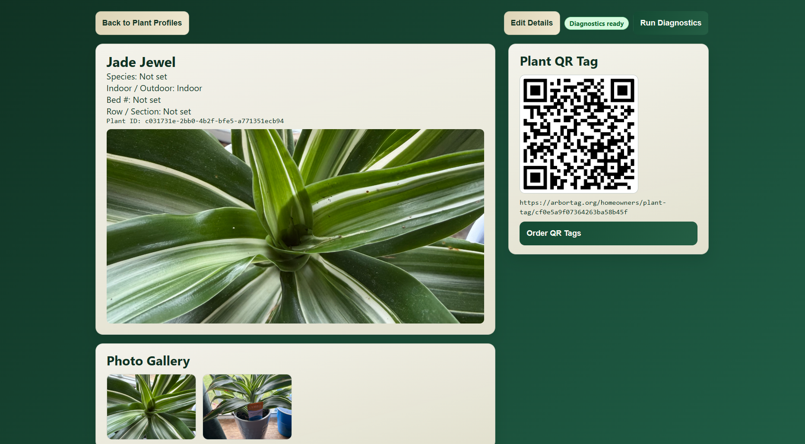
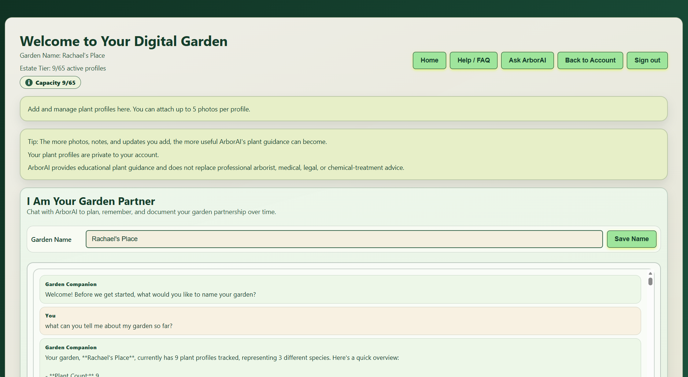
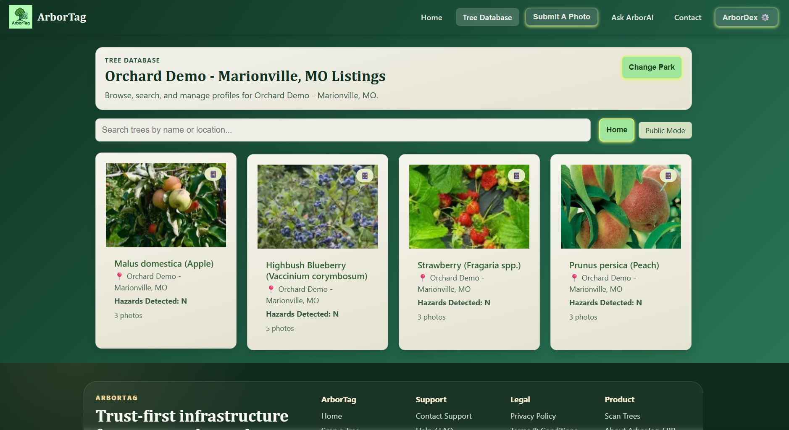

# ArborTag / ArborDex

[](LICENSE)


ArborTag (ArborDex) is a deployed full-stack SaaS platform that helps homeowners, municipalities, and parks manage living assets through QR-tagged digital records, AI-assisted diagnostics, and cloud-based plant history. The platform was designed to replace fragmented paper records and improve long-term stewardship of trees and landscapes.

The platform supports homeowner and municipal workflows through authenticated dashboards, cloud-hosted records, and AI-assisted features.

**Live Demo:** https://arbortag.org/

## My Role

Sole developer responsible for:

- Product architecture
- Frontend development (React)
- Backend APIs (Node.js/Express)
- Database design (Supabase/PostgreSQL)
- AI integrations
- Deployment and production infrastructure

## What This Project Demonstrates

- Full-stack product development with separate client and server applications
- Real-world iterative delivery across authentication, billing, diagnostics, and data modeling
- Migration-safe backend design while shipping new schema features
- Deployment and environment management for a production-style web app

## Core Features

- QR-based plant and tree profile access
- Homeowner and parks/city focused flows
- Secure user authentication and role-based dashboards
- AI-assisted diagnostics and conversational gardening workflows integrated with external AI services
- Journal and event tracking for plant history
- Tiered account support and Stripe billing integration
- Supabase-backed storage and relational data modeling

## Tech Stack

- Frontend: React, Vite, JavaScript, CSS
- Backend: Node.js, Express
- Data: Supabase, PostgreSQL, SQL migrations
- Payments: Stripe
- Tooling and Deployment: Git, GitHub, Render

## Technical Highlights

- Designed and shipped a full-stack SaaS architecture from scratch
- Built RESTful APIs supporting authenticated user workflows
- Modeled relational data using PostgreSQL through Supabase
- Integrated Stripe subscription billing flows
- Implemented AI-assisted diagnostic and conversational workflows
- Deployed and maintained a production web application on Render

The project emphasizes maintainability, iterative feature delivery, and production-oriented architecture rather than serving as a tutorial or proof of concept.

## Architecture

```text
┌───────────────┐
│ React (Vite)  │
└──────┬────────┘
       │ REST API
┌──────▼────────┐
│ Express API   │
└──────┬────────┘
       │
┌──────▼────────┐
│ Supabase      │
└──────┬────────┘
       │
┌──────▼────────┐
│ PostgreSQL    │
└───────────────┘
```

## Repository Structure

```text
client/      React application
server/      Express API and SQL scripts
docs/        Project documentation and planning notes
render.yaml  Render deployment configuration
```

## Local Development

### Prerequisites

- Node.js 18+
- npm
- Supabase project credentials
- Stripe keys (for billing flows)
- OpenAI API key (for AI features)

### Install

1. Install root dependencies:

	npm install

2. Install client dependencies:

	cd client
	npm install

3. Install server dependencies:

	cd ../server
	npm install

### Environment Setup

- Follow [SUPABASE_SETUP.md](SUPABASE_SETUP.md)
- Use environment variables for all keys and secrets
- Do not commit local .env files

### Run Locally

From repository root:

- Start backend:

  npm run dev:server

- Start frontend:

  npm run dev:client

Frontend runs on port 5173 and backend on port 5000 by default.

## Deployment

- Render deploy configuration is included in [render.yaml](render.yaml)
- Frontend can be built with:

  npm run build

## Future Roadmap

- GIS mapping enhancements for property and park layouts
- Expanded municipal reporting and analytics exports
- Offline synchronization for field workflows
- Enhanced AI diagnostics confidence and trend tracking
- Mobile experience improvements for on-site use

## Screenshots

### Homeowner Edition Plant Profile



### Homeowner Edition Diagnostics View



### Homeowner Edition Dashboard View



## Security Notes

- Secrets and service-role keys are environment-driven
- Keep local .env files untracked
- Consider rotating keys if they were ever exposed

## License

This project is licensed under the MIT License. See [LICENSE](LICENSE).
